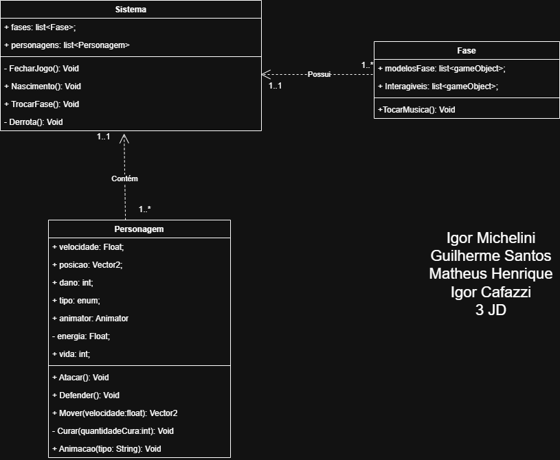

<h1>Toy Game</h1>
<h3>Produzido por Igor Cafazzi, Guilherme Santos, Matheus Henrique e Igor Michelini</h3>

<h4>link do drive para o projeto: https://drive.google.com/file/d/18isTfCC2_tBeEU_81UaEKe2m1XJsZjwt/view?usp=sharing</h4>

<h2>Filmes Inspiração</h2>
<ul>
  <li>Toy Story</li>
  <li>Flow</li>
  <li>Extraordinário</li>
  <li>Sonhos Roubados</li>
</ul>

<h2>Diagrama de Classes</h2>

<h3>Uso de Caso</h3>
<h4>Personagem</h4>
A classe utilizada para os personagens dentro do jogo, se comportarão diferente baseado no seu tipo (Jogador, Inimigo, Chefe).  
Nela são armazenadas seus atributos, como vida, dano, energia, velocidade e posição.  
Também contém uma referência ao Animator para tocar animações usando seu método Animacao. Também possui métodos para mover, atacar, defender e curar vida. 

<h4>Sistema</h4>
Gerencia o fluxo geral do jogo. Contendo uma referência a todas as fases e a todos os personagens presentes nela.  
Tem métodos para fechar o jogo, trocar de fase e de derrota caso o jogador perca.  
O método Nascimento serve para checar os personagens presentes na fase, assim é capaz de evitar situações como haver dois jogadores ou inimigos demais em uma fase. 

<h4>Fase</h4>
Uma classe simples, contém uma referência a seu tema de fundo, seu tileset (modelosFase) e a todos os interagíveis presentes nela.
Utiliza do método TocarMusica para tocar seu tema de fundo.

## wiki
- [1- Conceitos utilizados](https://github.com/MicheliniDev/MostraToyGame/wiki/1%E2%80%90-Conceitos-Utilizados)
- [2- Gameplay](https://github.com/MicheliniDev/MostraToyGame/wiki/2%E2%80%90-Gameplay)
- [3- Cena cidade](https://github.com/MicheliniDev/MostraToyGame/wiki/3%E2%80%90-Cena-da-Cidade)
- [4- Cena 2](https://github.com/MicheliniDev/MostraToyGame/wiki/4%E2%80%90-Cena-2)
